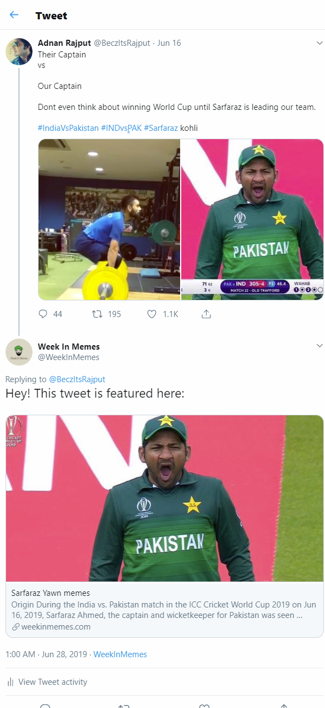

# Social Media Automation

Every week I write a post on my blog about the memes people have been sharing the most in the past week. The blog, very creatively titled, is called [WeekInMemes](https://weekinmemes.com)

## Normal workflow

What I would do is:

1. Find trending topics on Twitter
2. Select the most popular tweets containing memes on that topic
3. Screenshot them and compile as a blog post
4. Add some commentary of my own (like source of the meme template, a few one-liners, etc.)

To promote my blog on social media, what I would do every time I wrote a new post was:

1. Share it on Twitter and Facebook
2. Reply to the tweets I featured on the blog informing them that their tweet is featured
Eg. This tweet is featured on my blog, so I replied with the link to the page where it is featured:

3. Share all images from new posts to Pinterest

This meant I was spending considerable amount of time doing repetitive tasks. If there are 10 tweets featured in a post, I would take 10 screenshots, and then replying to each of those tweets with the link to the page. This isn't efficient and could be automated. So that's exactly what I did.

## Automated workflow

I've automated the entire process thus:

1. Collect all tweets in a CSV file in the format below. The "meme" column is merely the part of the URL to the page where the tweet will be featured. Eg. In https://weekinmemes.com/memes/india-orange-jersey/, 'india-orange-jersey' would be the text in the meme column.
```
meme,tweet,isreply
india-orange-jersey,https://twitter.com/IndianOilcl/status/1144972449944989696,no
india-orange-jersey,https://twitter.com/AndeDursu/status/1144671437606670336,no
india-orange-jersey,https://twitter.com/BCCI/status/1144608131063795713,no
india-orange-jersey,https://twitter.com/moronhumor/status/1144619955943555072,yes
india-orange-jersey,https://twitter.com/PandiyanDr/status/1144610576015867904,yes
india-orange-jersey,https://twitter.com/Siddhant_Rajak/status/1144882168524443648,no
sacred-games-2-trailer,https://twitter.com/naam_gumnam/status/1148487544218226688,no
sacred-games-2-trailer,https://twitter.com/ank_syal/status/1148485279533031424,no
sacred-games-2-trailer,https://twitter.com/voxxpopli/status/1148496415087157248,no
sacred-games-2-trailer,https://twitter.com/sagarcasm/status/1148497703447347200,no
```
2. Take screenshots of all tweets in the csv file using a [Python script](tweet-screenshot.md)
```
python take_screenshot.py <tweet-file.csv>
```
3. Optimize images
```
python optimize.py <meme-dir>
```
4. Write content
5. Publish post
```
hugo -D
cd public
git add .
git commit -m "commit message"
git push -u origin master
```
6. Share new posts to Facebook and Twitter [automatically using Zapier](zapier-automation.md)
7. Reply to all tweets featured in the posts [using Twitter API](tweepy-automation.md)
```
python reply_to_featured.py <tweet-file.csv>
```
8. Share all images in new posts to Pinterest [using Pinterest API](pinterest-automation.md)
```
python post_to_pinterest.py <num-pages>
```

Replace the contents within <> with the appropriate variables and I'm done

So now the "manual" steps are only collecting tweets and writing content. Rest is handled by Python scripts :)