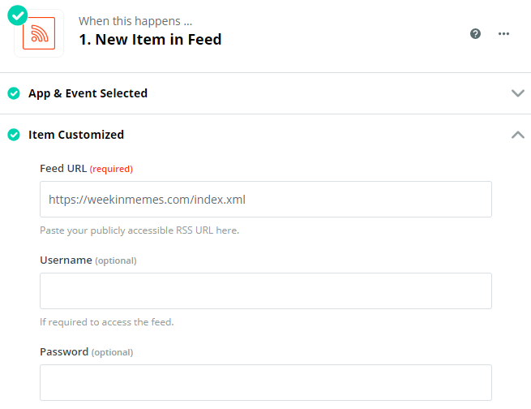
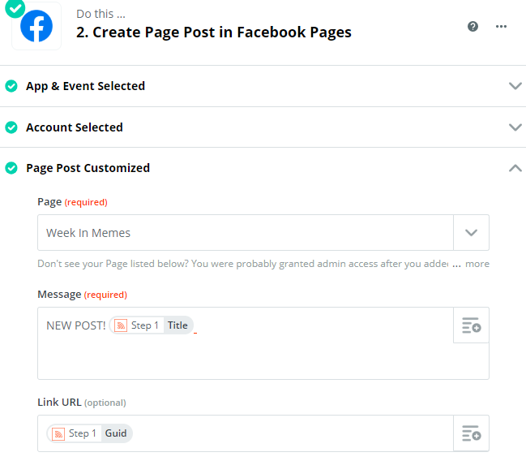
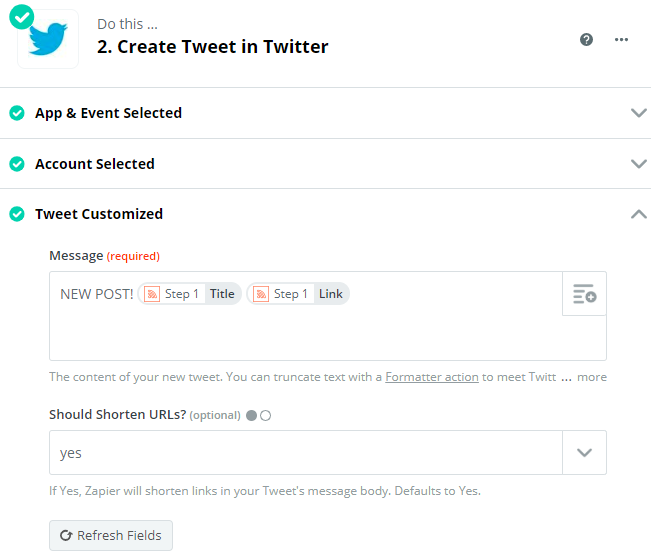

# Automating using Zapier

Zapier is a great tool to automate your marketing.

You can create workflows called "Zaps", with a trigger and a subsequent action. For me, the trigger would be a new post on my blog and the required action would be sharing that post on Facebook and Twitter from my account.

So that's exactly what I did. I created 2 separate Zaps. One for Facebook and one for Twitter. I connected my Facebook and Twitter accounts and was good to go.

The trigger for both was the same - new post on the blog. The way Zapier knows there is a new post is by checking the RSS feed and finding new items.

So the Zap for Facebook looked like this:

And for Twitter, it looks like this:

